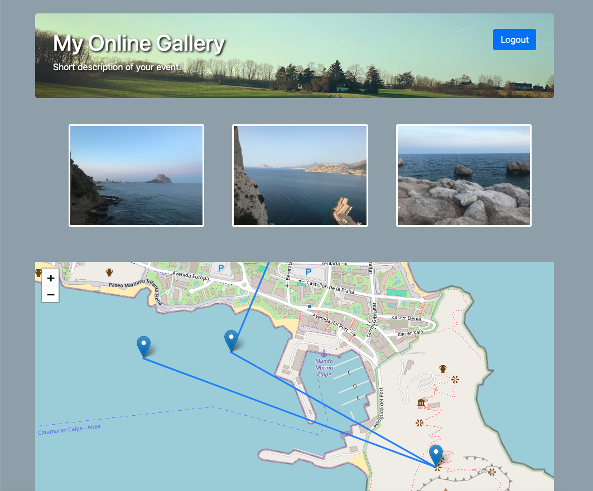

# My Online Gallery (myonlinegallery)

**My Online Gallery** is a simple to use and install picture gallery, to share your pictures and photos on a secure way and is only accessible to everyone with the right accesscode. It's like an online Photo book.  
In addition it has map function, which creates a path of the pictures in the directory (itinerary).

## Installation
Edit the "index.php" and change the Variable "$accesscode", "$pagetitlename" and "$shortDescription".  
Simply copy the files and directories to your server.  
Copy your images into the sub Folder "img".  

Open you domain include the **My Online Gallery** install dir in your browser (example www.yourdomain.com/myonlinegallery).  

Aditional you can change the picture in the header, by replacing the "header.jpg" file under "styles" (it should be a picture in wide resolution).  

The following external libraries are used:
- jQuery
- lightgallery
- Bootstrap
- Leaflet

## Description
The login (accesscode validation) is done in PHP to grant access to the server.  
Only if the access code is valid, the pictures will be show with the used JavaScript libraries.  

## Contributing
Pull request are welcome. For major changes, please open an issue first to discuss what you would like to change.  

Please make sure to update test as appropriate.  

## License
TBD (Currently i'm not quite familiar with this, it's my first opensource project.)  
