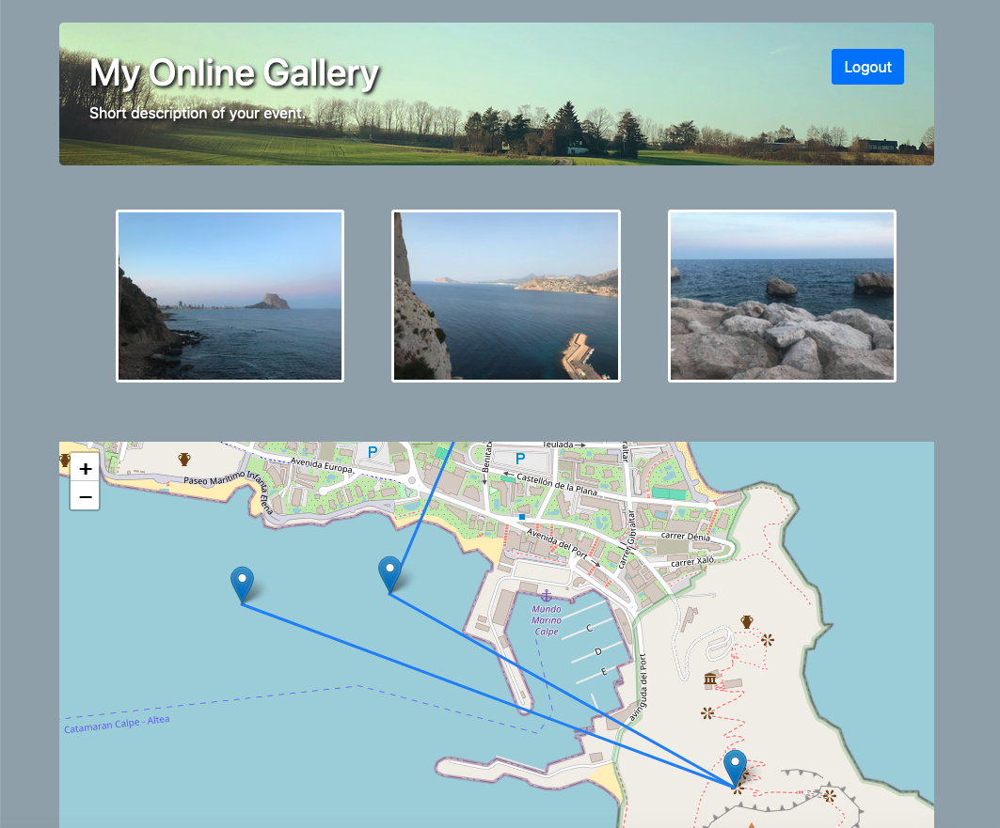

# My Online Gallery (myonlinegallery)

**My Online Gallery** is a simple to use and install picture gallery, to share your pictures and photos on a secure way and is only accessible to everyone with the right accesscode. It's like an online Photo book.  
In addition it has map function, which creates a path of the pictures in the directory (itinerary).

## Installation
Copy the files and directories to your server.  
Copy your images into the sub folder `img`.  
Copy `config/config.php.example` to `config/config.php` and change the access code, title and description there.  
Make sure PHP has write access to `cache/`, and that the `gd` and `exif` extensions are enabled for thumbnails and metadata.  

Open your domain including the **My Online Gallery** install dir in your browser (example `www.yourdomain.com/myonlinegallery`).  
To prebuild metadata and thumbnails before the first visitor opens the page, run `php bin/warm-cache.php`.  

Additionally you can change the picture in the header by replacing `styles/header.jpg`.  

The following external libraries are used:
- lightGallery
- Leaflet
- Leaflet.markercluster

## Description
The login (access code validation) is done in PHP to grant access on the server.  
Only if the access code is valid, the gallery and map are rendered.  
Gallery metadata is cached in `cache/gallery-index.json` and thumbnails are generated into `cache/thumbs` to keep repeated page loads fast.  

## Project structure
- `index.php`: request handling and bootstrapping
- `config/`: default config and optional local overrides
- `lib/`: gallery, auth and helper functions
- `templates/`: HTML rendering
- `assets/`: custom CSS and JavaScript
- `cache/`: generated metadata cache and thumbnails
- `bin/warm-cache.php`: CLI warmup for metadata and thumbnails

## Contributing
Pull request are welcome. For major changes, please open an issue first to discuss what you would like to change.  

Please make sure to update test as appropriate.  

## License
TBD (Currently i'm not quite familiar with this, it's my first opensource project.)  
